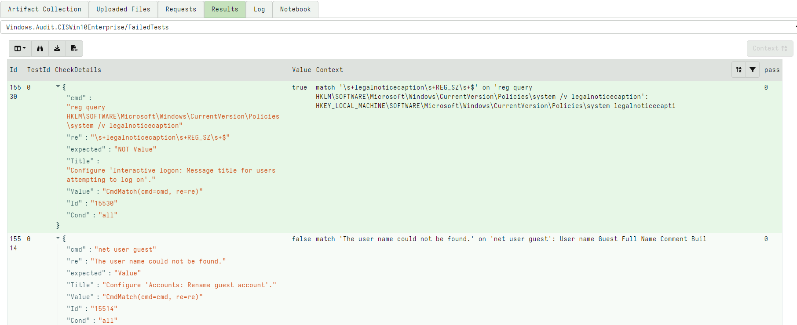

## VQL Checks

This project maintains a set of `Checks` that will be converted to a
VQL artifact.

### What are checks?

A check is a simple boolean Yes/No question - for example, does this
system enable account lockout? The check will specify a number of
`tests` with an `expected outcome` and a `measured outcome`. If these
differ we say the test failed.

One common use case for checks is compliance and hardening guides. In
this context, a check may indicate a potential for remediation.

A test will also contain an explanation as to what the test means and
how it should be interpreted.

## Architectural Overview

Maintaining and declaring checks is a challenging task - there are
many things we need to check for and many way we can check for
these. Ultimately we need a VQL artifact that performs these checks
but maintaining the final VQL artifact directly is not ideal.

Therefore this project defines an intermediate data structure we call
the `Rule` data structure. This declares a number of `Checks` and
sufficient metadata so the `Audit` project is able to convert these
into a fully functional VQL artifact.

## Rule File format

The Rule file contains some metadata that will be used in the final
artifact generation followed by a list of `Checks`. Each Check
consists of a number of `Rules` that can be combined in some logical
way.

You can find sample files under the `rules/` directory. For example:

```yaml
# Some metadata about the source of this rule file.
Source: cis_win10_enterprise.yml

# The artifact that will be generated will be named this name.
ArtifactName: Windows.Audit.CISWin10Enterprise

# Specify a precondition for this artifact
Precondition: |
  SELECT * FROM info() WHERE OS =~ "windows"

# This Description will be added to the artifact.
Description: |
  This artifact was generated from the Wahzu SCA project.

# This export section will be included in the produced artifact.
# Here you can define VQL functions that can be reused in the
# rest of the artifact.
Export: |
  LET RunPowerShell(S) = SELECT * FROM execve(
      argv=["Powershell", "-ExecutionPolicy",
            "unrestricted", "-EncodedCommand",
            base64encode(string=utf16_encode(string=S))])

Checks:
  # This is the ID of the check - it should be unique.
- Id: "15500"

  # This text describes the check and will be reported
  Title: Ensure 'Enforce password history' is set to '24 or more password(s)'.

  # How the tests should be combined. This can be "all", "any", "none"
  Condition: all

  # Now follows a series of tests - each test will produce a Yes/No
  Rules:
    # Name of the column (Value)
  - Name: Value

    # A VQL expression that calculates the value
    ColumnExpression: int(int=CmdOut(cmd=cmd, re=re).g1 || 0)

    # A WHERE expression that filters the value
    # If this is true the test is said to have passed
    WhereExpression: Value  >= 24

    # A note of the original test (e.g. the SCA rule).
    OriginalTest: c:net.exe accounts -> n:Length of password history maintained:\s+(\d+)
      compare >= 24

    # A dict that will be injected into the query
    # you can pass constants efficiently to the query here.
    Env:
      cmd: net.exe accounts
      re: Length of password history maintained:\s+(\d+)

  # If this is set the rule is disabled and will not be included in the artifact.
  Disabled: false
```

### Building an artifact

To compile the rule file into an artifact use the `audit` tool with
the `vql` sub command.

```
$ ./auditor vql ./rules/SCA/cis_win10_enterprise.yml /tmp/
Will write file to /tmp/Windows.Audit.CISWin10Enterprise.yaml
```

This generates the artifact file from the rules file. You can import
this into Velociraptor in the usual way.

### Importing compliance checks from other projects.

Internally the `Rules` format fully defines each check and audit, but
this file may be imported from other sources.

Currently there is an importer from the `Wazuh` project's SCA
repository that will convert these files into the expected format.

The importer will first read the target rule file and search for
checks that are disabled. Checks that are not disabled will not be
merged!

The new checks are merged into the existing file. The converter parses
the Wazuh rule format and produces a compatible rules file.

NOTE: This conversion is not perfect! Therefore all imported checks
are marked as disabled initially and are not included in the final
artifact. The user should manually verify all artifacts before
enabling the checks.

## Running Checks on a live System

The output of this project is a VQL artifact that should be collected
on the live system. The artifact will generate a set of results into
several artifact sources.

### The FailedChecks source

This source should all the checks that were failed. This is a high
level overview with just the check id and the title shown. Note that a
check may fail if some combination of its tests pass, so there may be
a number of reasons for why a check is considered failed.

### The FailedTests source

To understand why a particular check has failed we need to examine
each test in that check. Remember that a check is a collection of
tests which are combined to produce a pass/fail.

In the `FailedTests` source we see the reason why each specific test
is failing. The below is an example of some failed tests.



By examining the output from this source the user can determine
exactly why a particular check is considered to have failed. The
`CheckDetails` column provides information about the check that was
actually performed, while the `Value` column provides the value that
was retrieved from this test. Some tests also provide a `Context` with
additional information explaining their decisions.

The above example screenshot has the following test:

```json
{
  "Id": 15530,
  "TestId": 0,
  "CheckDetails": {
    "cmd": "reg query HKLM\\SOFTWARE\\Microsoft\\Windows\\CurrentVersion\\Policies\\system /v legalnoticecaption",
    "re": "\\s+legalnoticecaption\\s+REG_SZ\\s+$",
    "expected": "NOT Value",
    "Title": "Configure 'Interactive logon: Message title for users attempting to log on'.",
    "Value": "CmdMatch(cmd=cmd, re=re)",
    "Cond": "all"
  },
  "Value": "true",
  "Context": "match '\\s+legalnoticecaption\\s+REG_SZ\\s+$' on 'reg query HKLM\\SOFTWARE\\Microsoft\\Windows\\CurrentVersion\\Policies\\system /v legalnoticecaption': \r\nHKEY_LOCAL_MACHINE\\SOFTWARE\\Microsoft\\Windows\\CurrentVersion\\Policies\\system\r\n    legalnoticecapti",
  "pass": 0
},
```

We can see the following information:
1. The Check ID is 15530, and this is the first test in this check.
2. The Check is looking for an interactive logon message being set (`CheckDetails.Title`)
3. It does this by calculating the result of the `CmdMatch` VQL function (this can be added to the `Exports` section). Note that the VQL function is called with two variables `cmd` and `re`. These values are specified in the `CheckDetails`
4. The `CmdMatch` function runs an external command and compares its output to the regular expression specified.
  * In this case the external command is `reg query` to view the contents of the `legalnoticecaption` value.
  * The regex to match is `\s+legalnoticecaption\s+REG_SZ\s+$`
5. We see the Value (which is the result of the `CmdMatch` function)
   is true which means the regex did match the output of the command,
   but in this test the expected output is to `NOT Value`, causing the
   test to fail.
6. We can see some context in this case - the actual output of the command for inspection.

## Example 2:

Another example is the next test:
```
{
 "Id": 15514,
 "TestId": 0,
 "CheckDetails": {
   "cmd": "net user guest",
   "re": "The user name could not be found.",
   "expected": "Value",
   "Title": "Configure 'Accounts: Rename guest account'.",
   "Value": "CmdMatch(cmd=cmd, re=re)",
   "Id": "15514",
   "Cond": "all"
  },
  "Value": "false",
  "Context": "match 'The user name could not be found.' on 'net user guest': User name                    Guest\r\nFull Name                    \r\nComment                      Buil",
  "pass": 0
}
```

This test similarly runs the `net user guest` command and expects to
see `The user name could not be found`. In this case the `Context`
field shows the result of running the command - proving the guest user
actually exists on this system, therefore the test has failed.
